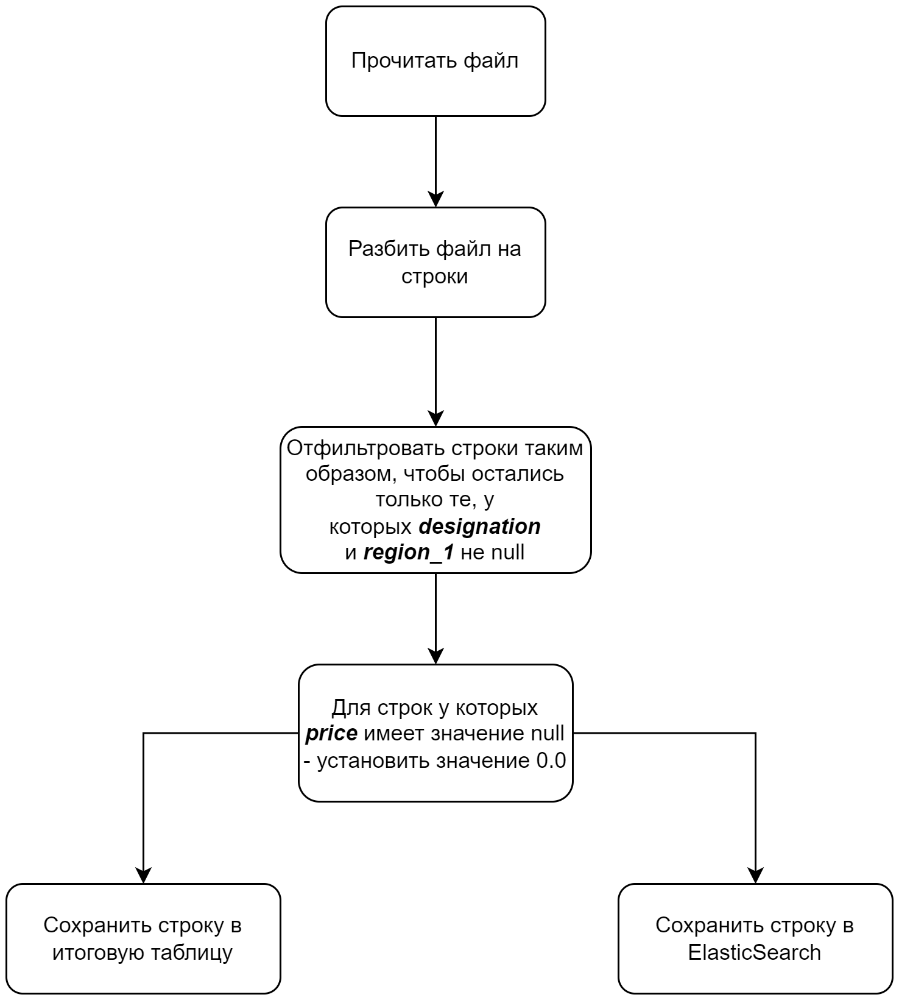
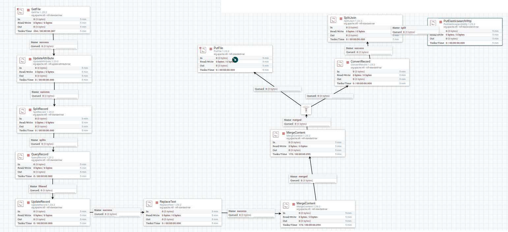
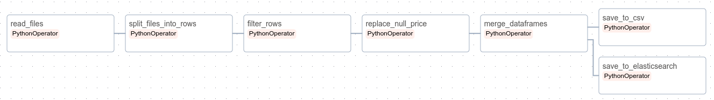

# Знакомство с основными инструментами построения пайплайнов: Apache Airflow и Apache NiFi
### Работу выполнила Вахлаева Марина 6231-010402D
## Начало работы
В рамках реализации данной лабораторной работы необходимо иметь установленный docker и vscode.
Перед началом работы были выполнены следующие действия: 

1. Клонирование репозитория с данными

     ```bash
    git clone git@github.com:ssau-data-engineering/prerequisites.git
    cd .\prerequisites\
    ```

2. Перед запуском контейнеров выполняется следующая команда:

    ```bash
    docker network create data-engineering-labs-network
    ```

3. Подготовка к запуску Apache airflow

    ```bash
    docker compose -f docker-compose.airflow.yaml up airflow-init
    ```

4. Запуск оставшихся контейнеров:

    ```bash
    docker compose -f docker-compose.airflow.yaml up --build -d
    ```    
    
    ```bash
    docker compose -f docker-compose.nifi.yaml up --build -d
    ```    
    
    ```bash
    docker compose -f docker-compose.elasticsearch.yaml up --build -d
    ```    
    
    ```bash
    docker compose -f docker-compose.postgresql.yaml up --build -d
    ```

    ```bash
    docker compose -f docker-compose.mlflow.yaml up --build -d
    ```

5. Перечень сервисов с их адресами

* pgAdmin: <http://localhost:18081/>  (`pgadmin4@pgadmin.org`@`admin`)
* Kibana: <http://localhost:15601/>
* Apache Airflow: <http://localhost:8080/> (`airflow`@`airflow`)
* Apache Nifi: <http://localhost:18080/>
* MLflow: <http://localhost:5001>
* Minio: <http://localhost:9000> (`minio`@`minio123`)

## Задание 
Необходимо построить простейший пайплайн, собирающий воедино данные из нескольких файлов, обрабатывающий их и сохраняющий результат в no-sql базу данных.

Для построения такого пайплайна необходимо воспользоваться следующими инструментами:
* Apache Airflow
* Apache NiFi
* ElasticSearch
* Kibana

Данные - набор из нескольких CSV файлов, полученных из набора данных [wine-review](https://www.kaggle.com/datasets/zynicide/wine-reviews/)

CSV файлы с данными можно найти в папке `data` данного репозитория.

Схема описывающая пайплайн, который необходимо построить в рамках лабораторной работы:



Данный пайплайн должен быть построен ***дважды***: один раз с использованием **Apache Nifi** и второй раз с использованием **Apache Airflow**.

Также средствами `Kibana` построить гистограмму стоимости напитка к баллам поставленными дегустаторами.

**Под сохранением в итоговую таблицу подразумевается объединение всех строк прощедших через пайплайн в единую .csv таблицу**

## Apache Nifi 

Для выполнения работы данные были помещены в папку, доступную для nifi. 

После запуска контейнеров, перейдя на адрес <http://localhost:18080/>, на схеме был построен пайплайн из процессоров, он представлен на рисунке ниже: 



Для реализации пайплайна были использованы следующие процессоры: 

     * GetFile
     
     * UpdateAttribute
     
     * SplitRecord
     
     * QueryRecord
     
     * UpdateRecord
     
     * ReplaceText

     * MergeContent (2 шт)
     
     * PutFile
          
     * ConvertRecord
     
     * SplitJson

     * PutElasticsearchHttp

Процессор `UpdateAttribute` был добавлен для правильного слияния всех файлов. Он переименовывал каждый входной файл и давал им всем единое название, иначе пайплайн работал не правильно.

Второй `MergeContent` использовался для избежания переполнения памяти и правильности записи в конечный csv-файл. При использовании только одного такого процессора происходило 
переполнение памяти. Nifi просто переставал работать, а когда работал, то в конечный файл записывалось всегда разное количество строк. Ковырялась в настройках процессоров и очередей, 
это не помогло. Возникала проблема переполнения архива Nifi. Было изменено время ожидания пакета - тоже безуспешно. Также эмперическим путем было обнаружено, что использование второго
такого процессора решает все возникающие раннее проблемы. "Если работает, то не будем это трогать". У первого процессора было выставлено в параметрах прием большого количества пакетов 
с небольшим временем ожидания, а у второго - прием небольшого количества крупных пакетов данных с большим временем ожидания. В конечном счете csv-файл стал правильно формироваться и
количество строк совпадало из запуска в запуск!

Процессоры `ConvertRecord` и `SplitJson` были необходимы для правильного функционирования экспорта в Elasticsearch. 

### Основные проблемы, с которыми столкнулись при реализации. 

- Если раньше не было опыта работы с потоками данных, то настройка оптимальных параметров для передачи может занять много времени.
Поскольку раньше не имела дела с потоковыми данными, параметры процессоров и очередей, связанные с максимальным объемом пакетов данных, с задержкой передачи и т.п. 
были не очень понятны в настройке. Документация очень ограниченная, информации по данной теме в интеренете не так много. 
- Были проблемы в основном связанные с настройкой параметров процессоров. На первых этапах удавалось получить итоговый .csv файл, но в нем записывались
названия столбцов для каждой строчки, т.е. при слиянии для каждой срочки прописывались названия полей, которые также передавались в итоговый файл, 
проблему получилось решить, исполььзуя процессор `ReplaceText`. Далее возникала проблема, связанная с обработкой поля price. Процессор `UpdateRecord` 
удалял строчки, в которых price = None, вместо замены на значение 0.0. Изменить это удалось эмперическим путем, подбора "регулярного выражения" для обработки данного поля. 
Часто преследовала нерепрезентативность и вариабельность полученного результата. Записывалось строчек меньше, чем обрабатывалось на самом деле. Утечка данных. 
- Nifi контейнер плохо работал, иногда был запущен, а локалхост не открывался и т.п. В общем работал через раз.

## Apache Airflow 

Исходные данные csv-файлы были помещены в директорию `data/initial` контейнера Airflow. DAG-файл (`main.py`) находится в каталоге 

### Схема пайплайна в Airflow 


Проблем при реализации не возникло. После nifi как по маслу. 

### График зависимости стоимости напитка к баллам поставленными дегустаторами


## Вывод: 

Apache nifi вызвал миллион проблем, для работы с ним нужно приноровиться. Аpache Airflow понравился в реализации, затрудней в реализации пайплайна не было.
